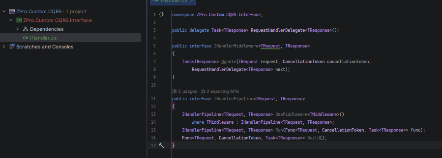

# Build Own MediatR Library

Adalah sebuah sample aplikasi yang me-replikasi mekanisme kerja MediatR.

Sample ini sangat berguna apabila digunakan untuk memisahkan command dan query akan tetapi tidak ingin memakai library berbayar **MediatR**.


## Background:

Ketika membuat Rest API di .Net, akan muncul pertanyaan apakah membutuhkan **MediatR**?.

**MediatR** ada sebuah library yang bagus yang bisa memberikan request/response model yang clean, pipeline behaviour dan mekanisme yang cantik untuk sentralisasi cross-cutting.


## What will be implemented:

Disini akan diimplementasikan minimal pipeline yang mekanismenya hampir sama dengan `MediatR`, hanya saja dibuat secara custom.

- `HandlerPipeline<TRequest, TResponse>`

- `ValidatorMiddleware<TRequest, TResponse>`

- Fluent registration dengan `UseMiddleware<T>().Run(handler).Build()`


## Goal:

Harapannya adalah kita ingin eksekusi request seperti dibawah ini:

```csharp
var response = await pipeline
    .UseMiddleware<ValidatorMiddleware<CreateOrderCommand, Guid>>()
    .UseMiddleware<LoggingMiddleware<CreateOrderCommand, Guid>>()
    .Run((request, ct) => handler.Handle(request, ct))
    .Build()
    .Invoke(command, cancellationToken);
```

## Step To Build:

1. Define the core contract
   
   
   
   ```csharp
   public delegate Task<TResponse> RequestHandlerDelegate<TResponse>();
   
   public interface IHandlerMiddleware<TRequest, TResponse>
   {
       Task<TResponse> Handle(TRequest request, CancellationToken cancellationToken,
           RequestHandlerDelegate<TResponse> next);
   }
   
   public interface IHandlerPipeline<TRequest, TResponse>
   {
       IHandlerPipeline<TRequest, TResponse> UseMiddleware<TMiddleware>()
           where TMiddleware : IHandlerPipeline<TRequest, TResponse>;
       IHandlerPipeline<TRequest, TResponse> Run(Func<TRequest, CancellationToken, Task<TResponse>> func);
       Func<TRequest, CancellationToken, Task<TResponse>> Build();
   }
   ```

2. Implement `HandlerPipeline<TRequest, TResponse>`
   
   Pipeline menyimpan tipe-tipe middleware, menangkap handler final dan membungkus semuanya dalam order terbalik (reverse order)
   
   

3. 
